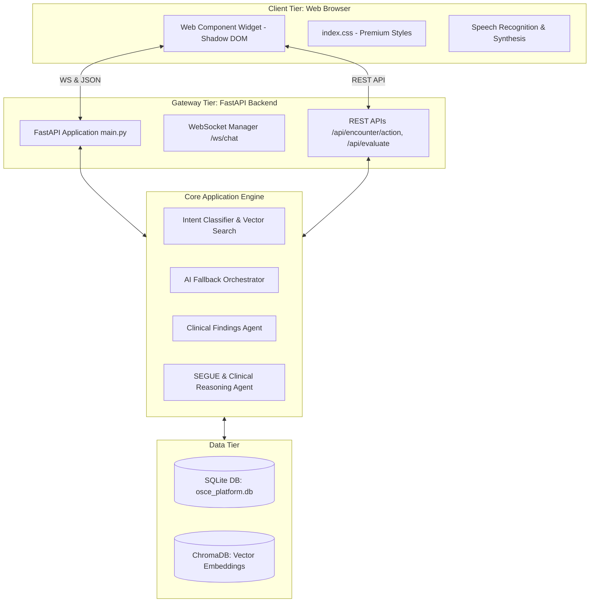
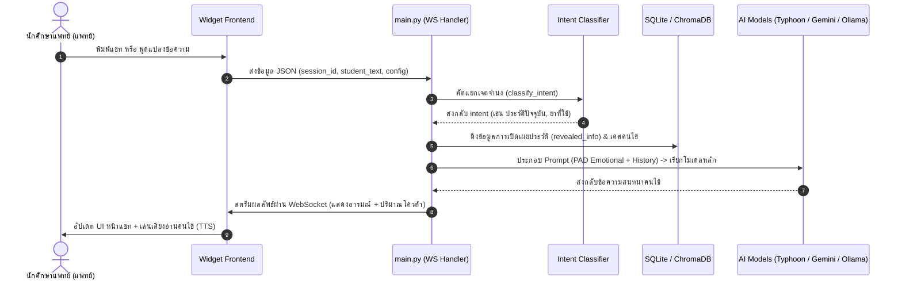
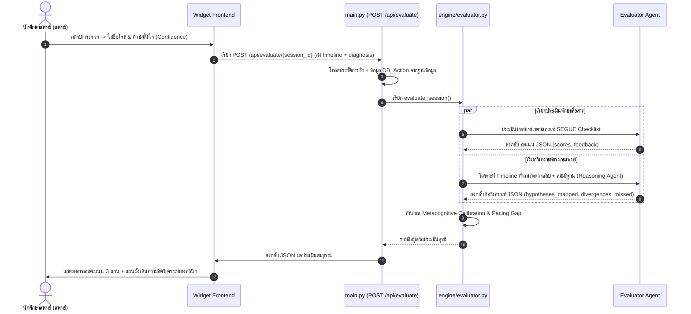
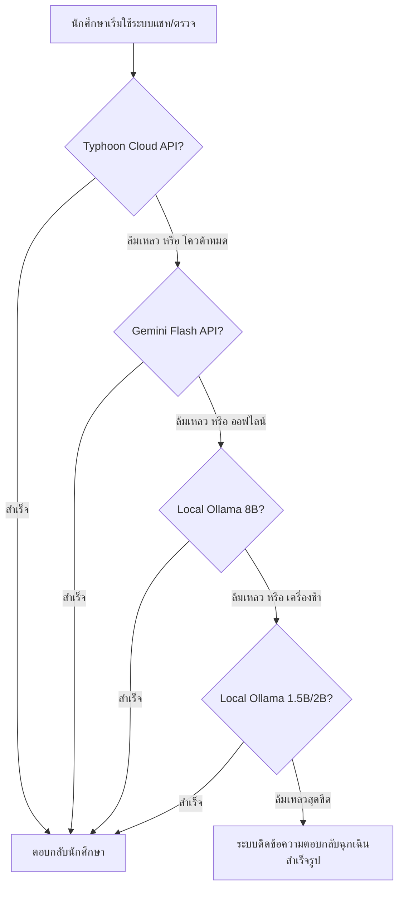

# รายงานสถาปัตยกรรมและการทำงานทางเทคนิคเชิงลึก (OSCE AI Patient Simulator Technical Architecture Report)

รายงานฉบับนี้แสดงรายละเอียดโครงสร้างสถาปัตยกรรมซอฟต์แวร์ (Software Architecture) แบบจำลองฐานข้อมูล (Database Schema) ตรรกะการประมวลผลคำสั่ง และพรอมต์ระบบ (System Prompts) ของแอปพลิเคชันสอบจำลองซักประวัติแพทย์ (OSCE AI Patient Simulator) เพื่อเป็นข้อมูลอ้างอิงเชิงพัฒนาและวิศวกรรมระบบ

---

## 1. ภาพรวมสถาปัตยกรรมทางเทคนิค (Technical Architecture Overview)

ระบบทำงานบนโครงสร้างสถาปัตยกรรมแบบ **Client-Server Dynamic Architecture** โดยแยกส่วนการแสดงผล (Front-end Widget) และส่วนควบคุมประมวลผล (Back-end Engine) ออกจากกันอย่างเด็ดขาด ผ่านทางโปรโตคอล WebSocket (สำหรับการแชทสองทางแบบเรียลไทม์) และ RESTful API (สำหรับการดึงเคส สั่งตรวจร่างกาย และคำนวณผลประเมิน)



---

## 2. ลำดับขั้นตอนการไหลของข้อมูล (Data Flow & Component Interactions)

### 2.1 แผนภาพการแชทโต้ตอบ (WebSocket Real-Time Chat Sequence)
เมื่อผู้เรียนเริ่มพูดหรือพิมพ์คุยกับคนไข้จำลอง ลำดับขั้นตอนการทำงานจะเป็นดังนี้:



---

### 2.2 แผนภาพการประเมินวิเคราะห์ (Post-Evaluation & Calibration Map Sequence)
เมื่อนักศึกษากดสิ้นสุดการรักษาและส่งวินิจฉัยเพื่อคำนวณรายงานผลการซักประวัติ:



---

## 3. สถาปัตยกรรมฐานข้อมูลเชิงสัมพันธ์ (Database Schema Definitions)

ฐานข้อมูลหลักเก็บไว้บน SQLite ไฟล์ `data/osce_platform.db` โดยมีรายละเอียดคอลัมน์และประเภทข้อมูล ดังนี้:

### 3.1 ตารางประวัติคนไข้จำลอง (`cases`)
* **วัตถุประสงค์:** จัดเก็บข้อมูลอาการสำคัญ รายละเอียดประวัติคนไข้ และข้อมูลตรวจร่างกายที่เป็นโครงสร้างข้อมูลต้นฉบับ
* **รายละเอียดคอลัมน์:**
  - `id` (VARCHAR, Primary Key): รหัสเคสโรค (เช่น `case_1`, `case_appendicitis`)
  - `scenario_name` (VARCHAR): ชื่อหัวข้อเคสโรคภาษาไทย/อังกฤษ (เช่น `Appendicitis (ไส้ติ่งอักเสบเฉียบพลัน)`)
  - `chief_complaint` (TEXT): อาการสำคัญนำส่งตรวจ
  - `category` (VARCHAR): หมวดหมู่เคสตรวจทักษะ (เช่น `GENERAL MEDICINE`)
  - `hidden_record` (TEXT): ข้อมูลประวัติอาการลับที่ใช้คัดกรอง Intent ในรูปของ JSON String

### 3.2 ตารางเซสชันการสอบซักประวัติ (`sessions`)
* **วัตถุประสงค์:** จัดเก็บข้อมูลภาพรวมเซสชันการซักประวัติ และผลการประเมินสุดท้ายของผู้เรียน
* **รายละเอียดคอลัมน์:**
  - `session_id` (VARCHAR, Primary Key): รหัสอ้างอิงเซสชันที่สร้างสุ่มจากหน้าบ้าน
  - `student_id` (VARCHAR): รหัสนักศึกษาแพทย์
  - `student_name` (VARCHAR): ชื่อ-นามสกุลผู้สอบ
  - `scenario_name` (VARCHAR): ชื่อโจทย์โรคที่เลือกสอบ
  - `status` (VARCHAR): สถานะเซสชัน ("active", "completed")
  - `evaluation_json` (TEXT, Nullable): ข้อวิเคราะห์ผลประเมินความ Calibrate และคะแนน SEGUE ในรูปของ JSON String
  - `created_at` (DATETIME): วันเวลาที่สร้างห้องสอบ
  - `updated_at` (DATETIME): วันเวลาที่มีการอัปเดตห้องสอบล่าสุด

### 3.3 ตารางบันทึกบทสนทนาการซักประวัติ (`dialogues`)
* **วัตถุประสงค์:** เก็บแชทล็อกคำถามและคำตอบทั้งหมดเพื่อใช้วิเคราะห์ประเมินผล
* **รายละเอียดคอลัมน์:**
  - `id` (INTEGER, Primary Key, Autoincrement): รหัสข้อความ
  - `session_id` (VARCHAR, Foreign Key): รหัสอ้างอิงเชื่อมกับตาราง `sessions`
  - `role` (VARCHAR): บทบาทผู้ส่งข้อความ ("user" แทนนักศึกษา, "assistant" แทนคนไข้จำลอง)
  - `content` (TEXT): เนื้อหาประโยคคำถามหรือคำตอบ
  - `created_at` (DATETIME): เวลาที่ส่งข้อความ

### 3.4 ตารางบันทึกการส่งตรวจร่างกายและผลแล็บ (`actions`)
* **วัตถุประสงค์:** เก็บล็อกพฤติกรรมการเรียกตรวจและเวลา เพื่อนำมาคำนวณโครงสร้างเส้นเวลาการตัดสินใจ (Reasoning Map Timeline)
* **รายละเอียดคอลัมน์:**
  - `id` (INTEGER, Primary Key, Autoincrement): รหัสการส่งตรวจ
  - `session_id` (VARCHAR, Foreign Key): รหัสอ้างอิงเชื่อมกับตาราง `sessions`
  - `action_type` (VARCHAR): ประเภทปฏิบัติการ ("physical_exam" หรือ "lab_test")
  - `target` (VARCHAR): อวัยวะหรือแล็บที่เลือกตรวจ (เช่น "Abdomen", "CBC")
  - `result` (TEXT): ผลคำอธิบายการตรวจคลินิก หรือตารางแล็บ Markdown ที่ AI ตอบกลับ
  - `elapsed_seconds` (INTEGER): วินาทีที่ผู้สอบกดเรียกสั่งตรวจ นับตั้งแต่เวลาเริ่มทำห้องสอบ
  - `created_at` (DATETIME): วันเวลาที่บันทึกข้อมูล

---

## 4. โครงสร้างและตรรกะระบบพรอมต์เอเจนต์ (Core Prompts Configuration)

ระบบคุมทักษะการสนทนาและการประเมินทางคลินิกถูกกำหนดให้ประมวลผลผ่านตัวแปร Prompt หลัก 3 ตัวบน backend:

### 4.1 พรอมต์วิเคราะห์ผลตรวจทางคลินิก (`CLINICAL_FINDINGS_SYSTEM_PROMPT`)
* **ความรับผิดชอบ:** เจนผลการตรวจร่างกาย (Physical Exam) และตารางผลแล็บ (Lab Table) ในรูปของ Markdown Table
* **สคริปต์ Prompt หลัก:**
```text
You are a precise medical virtual diagnostic database. When the student performs a physical exam or orders a lab test, your goal is to generate clinical-grade, case-matched findings.
Guidelines:
1. Return ONLY abnormal findings if they exist in the case history; otherwise, return normal expected findings.
2. For laboratory/imaging reports, return them formatted as a clean markdown table showing the parameters, values, reference ranges, and units.
3. If language is "en", output in English. If language is "th", output in Thai. Do not include metadata/commentary.
```

### 4.2 พรอมต์ประเมินความ Calibrate และวิเคราะห์ตรรกะแพทย์ (`REASONING_SYSTEM_PROMPT`)
* **ความรับผิดชอบ:** ค้นหาสมมติฐานโรคที่นักศึกษาคิดจากการสั่งตรวจ/ถาม, ค้นหาจุด Divergence และวิเคราะห์ Pacing
* **รูปแบบ JSON Schema ผลลัพธ์:**
```json
{
  "hypotheses_mapped": [
    {
      "action": "question or exam string",
      "timestamp": "MM:SS",
      "hypothesis": "differential diagnosis tested"
    }
  ],
  "divergences": [
    {
      "action": "sub-optimal action",
      "explanation": "why it was bad and recommendations"
    }
  ],
  "missed_opportunities": [
    {
      "missed": "what they forgot to ask/do",
      "reason": "clinical significance"
    }
  ],
  "calibration": {
    "student_confidence": 0-100,
    "student_diagnosis": "suspected diagnosis",
    "is_correct": true/false,
    "gap_analysis": "meta-cognitive analysis text"
  },
  "pacing_feedback": {
    "timeline_summary": "time management review text",
    "efficiency_recommendations": ["suggestion 1", "suggestion 2"]
  }
}
```

---

## 5. การทำงานสลับการประมวลผลสำรองอัตโนมัติ (Dynamic Failover Tiering)

เพื่อให้แพลตฟอร์มไม่มีอาการค้างขณะใช้งานสอบจริง ตัวระบบใช้สถาปัตยกรรมแบบ **Double Fallback Layer** ทั้งระดับแอปพลิเคชันหลัก และระดับการเชื่อมต่อเครือข่าย:



### 5.2 การป้องกัน Event Loop Closed ปรากฏระหว่างยิงทดสอบพร้อมกัน
ในส่วนตัววิเคราะห์ LLM คลาส `ollama.AsyncClient` อาจขัดข้องเนื่องจาก Loop ปิดตัวลงกะทันหันในการรันหลายเธรด ระบบได้เพิ่ม **Synchronous Fallback Implementation** ในโค้ด:

```python
try:
    response = await ollama_client.chat(model=OLLAMA_MODEL, messages=messages)
except Exception as async_err:
    print(f"Async failed, fallback to sync: {async_err}")
    # ใช้ sync client เชื่อมต่อตรงเพื่อความปลอดภัยสูงสุดและไม่มีผลกระทบต่อ thread
    sync_client = ollama.Client(host=OLLAMA_HOST)
    response = sync_client.chat(model=OLLAMA_MODEL, messages=messages)
```
โครงสร้างนี้มีระบบ Try-Catch ล้อมทุกจุด ช่วยรับประกันความเสถียรและความแม่นยำสูงเมื่อระบบเกิดการรันคำสั่งโต้ตอบพร้อมกันหลาย ๆ จุด

---

*รายงานสถาปัตยกรรมเชิงลึกจัดเก็บไว้ที่ไฟล์ [osce_technical_report.md](file:///c:/Users/Jean/Documents/Project%20R%20Last%20chace-%20OSCE/osce_technical_report.md) เรียบร้อยครับ*
